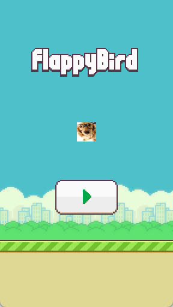
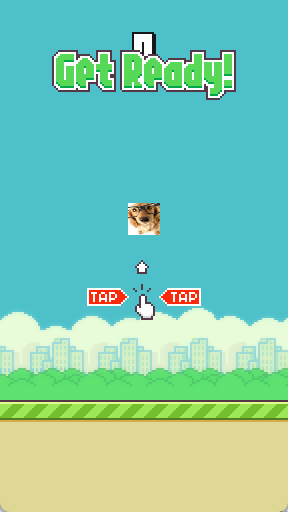
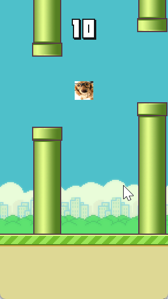
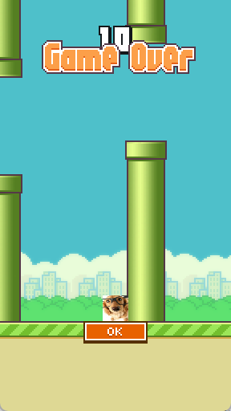

<h1 align="center">🐦 Flappy Furalha 🐦️</h1>

Flappy Furalha is a [Flappy Bird](https://dotgears.com/games/flappybird) clone made in Kotlin.

This was created because I was playing with 3D rendering in LWJGL, and after rendering a 3D cube with textures and lighting, I thought "man I think I'm biting more than I can chew, I haven't created a simple 2D game yet and I'm trying to do a 3D game?!", and that's how Flappy Furalha was born!

Well, actually I *have* created 2D games before... I did create [some 2D games 10+ years ago using GameMaker: Studio](https://mrpowergamerbr.com/br/projects/2d-game-hard/), and Loritta's dashboard does have a Shimeji-like "Spawn a Loritta that walks around the page" feature that has some game-like features like logic ticking, player movement (even tho the movement is controlled by an AI) and it used the canvas for rendering.

But a game, *from scratch*, using OpenGL? Never! I also wanted to make a web game too, and sadly those big modern game engines like Unreal/Unity/Godot/etc aren't *that* good for web exports... Heck, an empty Godot project using HTML export creates a 42MB WASM file!

"Why are you creating a game engine??? You can't create a game engine!!! Just use Unreal/Unity/Godot!!!" go fuck yourself

## Features

* A "good enough" Flappy Bird clone!
* Common Kotlin Multiplatform game logic, both renderers use the common game logic
* The game logic runs independently, running at 20 ticks per second. This means that the game physics is NOT affected by the FPS!
* Desktop Port (LWJGL/OpenGL)
* Web Port (WebGL2)

## How to Play

* **Web Version:** https://flappyfuralha.lori.fun/ (We don't use GitHub Pages because GitHub Pages SUCKS, omg I publish new changes and it takes YEARS for the changes to be live, what the hell how can anyone say that they LIKE GitHub Pages?!)
* **LWJGL Version:** Uuhh... I didn't setup any artifacts for it, so open the project in IntelliJ IDEA and run the `FlappyFuralhaLauncher` class inside the `flappy-lwjgl` module.

## Gameplay

Left is the WebGL2 renderer, right is the LWJGL renderer.

https://github.com/user-attachments/assets/f4dd6528-7daa-4860-94d3-562db40529f2

## Takeaways

The renderers are a bit sloppy, there is a lot of duplicate renderer code between `flappy-lwjgl` and `flappy-webgl2` that could be removed. I think it would be better to abstract the renderer on a lower level to avoid duplicate code between the renderers, because OpenGL/LWJGL and WebGL are VERY similar.

How similar? Most of the renderer code was ported by replacing function calls like `glCreateShader` to `gl.createShader`. Another thing is that WebGL2 is more strongly typed compared to LWJGL, things that were `Int` in the LWJGL renderer have been changed to `WebGLShader`, `WebGLTexture`, so on and so forth. Most of the WebGL2 porting issues were related to bugs in the bindings themselves, like `gl.clear` excepting a `GLbitwise` but you can't bitwise a `GLenum`, and functions excepting a number when you have `GLenum`. To work around this, you can `.toString().toInt()` the `GLenum`. Shaders were also needed to be changed to be `#version 300 es`, and fragment shaders in WebGL2 requires a precision to be set (`precision highp float;`). Also, LWJGL's quick start `glClearColor` uses alpha 0, and while that does work fine in LWJGL, in WebGL2 you are going to stare at a transparent color when clearing the screen.

By the way, first I created the game all in one JVM module using LWJGL, then I split up the game logic into a different module and kept the LWJGL renderer in `flappy-lwjgl`, and finally the WebGL2 module was created based on the `flappy-lwjgl` code.

Because JOML does not work in Kotlin Multiplatform, and copying the `Matrix4f` code to this project did not go well (the code was borked) I did hardcode the orthographic projection matrix in the WebGL2 renderer, and I create the MVP matrix for the sprites manually. Thankfully creating the matrix manually was easy because this is a 2D game that does not have any fancy rotations. It would be better to use [Matrix math for the web](https://developer.mozilla.org/en-US/docs/Web/API/WebGL_API/Matrix_math_for_the_web), but the reason why JOML is *so good* is that it has a lot of 3D related things too.

If you are using Kotlin/JS, use the `kotlin-wrappers:kotlin-browser` package instead of relying on the bindings provided by Kotlin/JS, the `kotlin-browser` bindings are WAY better, and they have newer APIs that aren't included in Kotlin/JS, like the WebGL2 rendering context.

The "game engine", if you can call it that, looks a bit similar to GameMaker (example: each room have a list of entities, and you can switch between rooms), which is funny because it was like a zap went off when coding and I thought "oh wow this looks like GameMaker". However, my friend said that a lot of game engines have similar concepts, whoops.

You may think that these people saying that "please create a small game first" are dumb and stupid and that you are so good because you already know how you are going to code your game... Well, when the rubber meets the road you find out that you haven't actually thought of everything and that there are a lot of things that you need to think and figure out how you are going to implement in your game. So yeah, try to create a simple game first!